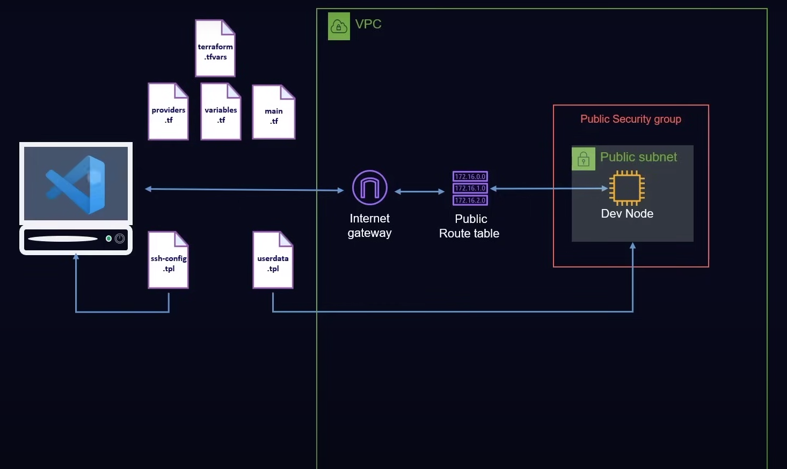

# Dev Environment with Terraform and AWS

## Overview
This project automates the provisioning of a development environment on AWS using Terraform. The infrastructure includes a Virtual Private Cloud (VPC), subnets, security groups, EC2 instances, and other AWS resources. The setup enables developers to SSH into an EC2 instance using VS Code for seamless development. Was done in MoreThanCertified platform course.  

## Architecture
<div align="center">
  
</div>

### Components:
1. **VPC (Virtual Private Cloud)** - A logically isolated network within AWS.
2. **Subnet** - A public subnet enabling instances to receive public IPs.
3. **Internet Gateway** - Allows internet access for resources inside the VPC.
4. **Route Table** - Routes traffic between the subnet and the internet gateway.
5. **Security Group** - Defines firewall rules controlling inbound/outbound traffic.
6. **EC2 Instance** - A virtual machine deployed within the subnet.
7. **Key Pair** - Used to establish SSH access to the EC2 instance.
8. **Provisioning via Terraform** - Automates the infrastructure deployment.

## Prerequisites
- [Terraform](https://developer.hashicorp.com/terraform/downloads) installed
- AWS CLI configured with valid credentials
- SSH key pair generated (`ssh-keygen -t ed25519`)

## Installation & Deployment

### 1. Initialize Terraform
```sh
terraform init
```

### 2. Plan the Infrastructure
```sh
terraform plan
```

### 3. Apply Configuration
```sh
terraform apply -auto-approve
```

### 4. Access the EC2 Instance via SSH
```sh
ssh -i ~/.ssh/your-key.pem ubuntu@<EC2_PUBLIC_IP>
```

### 5. Connect via VS Code
1. Open VS Code
2. Go to **View** → **Command Palette**
3. Type `Remote-SSH: Connect to Host...`
4. Select the public IP of the instance
5. Start developing in your new cloud-based environment

## Managing Infrastructure
- **Update Resources:**
  ```sh
  terraform apply -refresh-only
  ```
- **Destroy Resources:**
  ```sh
  terraform destroy -auto-approve
  ```
- **View State Information:**
  ```sh
  terraform state list
  ```


